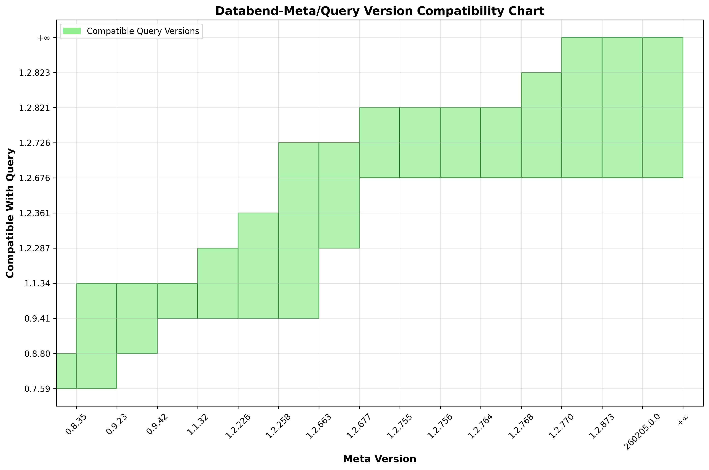

# Compatibility

## Client-Server Compatibility

The Client-Server compatibility changes when `MIN_METASRV_SEMVER` or `MIN_METACLI_SEMVER` changes.

The compatibility is stored in [compat.py](compat.py), and a corresponding illustration is generated:



History versions that are not included in the above chart:

- Client `[0.7.59, 0.8.80)`  is compatible with Server `[0.8.30, 0.9.23)`.
- Client `[0.8.80, 0.9.41)`  is compatible with Server `[0.8.35, 0.9.42)`.
- Client `[0.9.41, 1.1.34)`  is compatible with Server `[0.8.35, 1.2.663)`.
- Client `[1.1.34, 1.2.287)` is compatible with Server `[1.1.32, 1.2.63)`.

## Server-Server Compatibility

Raft protocol compatibility between meta-server nodes:

| Meta-Server version  | Backward compatible with |
|:-------------------- |:-------------------------|
| [0.9.41,   1.2.212)  | [0.9.41,  1.2.212)       |
| [1.2.212,  1.2.479)  | [0.9.41,  1.2.479)       |
| [1.2.479,  1.2.655)  | [1.2.288, 1.2.655)       |
| [1.2.655,  1.2.769)  | [1.2.288, 1.2.769)       |
| [1.2.769, +∞)        | [1.2.547, +∞)            |


- `1.2.53` Incompatible, rolling upgrade is allowed without snapshot transmitting.
  Snapshot format changed thus during rolling upgrading,
  it requires all node data to be up-to-date, ensure there is no need to replicate with snapshot.

- `1.2.163` Feature: gRPC API: `kv_read_v1()` is added. For stream reading.

- `1.2.212` 2023-11-16 Feature: raft API: `install_snapshot_v1()`. Compatible with old versions.
  Rolling upgrade is supported.
  In this version, databend-meta raft-server introduced a new API `install_snapshot_v1()`.
  The raft-client will try to use either this new API or the original `install_snapshot()`.

- `1.2.479` 2024-05-21 Remove: `install_snapshot()`(v0) from client and server.
  The `install_snapshot_v1()` is the only API to install snapshot, and becomes **REQUIRED** for the client.

- `1.2.528` 2024-06-13 Remove on-disk data version `V001`. The first version using `V002` is `1.2.53`, 2023-08-08.
  Therefore, since `1.2.528`, the oldest compatible version is `1.2.53`.
  Consequently, compatibility remains unchanged from this version onward.

- `1.2.552` 2024-07-02 Introduce on-disk `V003`, using `rotbl` format snapshot,
  which is compatible with `V002`. The oldest compatible version is `1.2.288`(`1.2.212~1.2.287` are removed).

- `1.2.655` 2024-11-11 Introduce on-disk `V004`, using WAL based Raft log storage,
  which is compatible with `V002`. The oldest compatible version is `1.2.288`(`1.2.212~1.2.287` are removed).


## On-Disk Data Compatibility

The on-disk data format evolves over time while maintaining backward compatibility.

| DataVersion | Server-version    | Min Compatible with |
|:------------|:----------------- |:--------------------|
| V004        | 1.2.655           | V002                |
| V003        | 1.2.547           | V002                |
| V002        | 1.2.53            | V001                |
| V001        | 1.1.40            | V0                  |

### Identifying the versions

Upon startup, meta-server will display the on-disk data version:

For example, running `databend-meta --single` produces:

```
Databend Metasrv

Version: v1.1.33-nightly-...
Working DataVersion: V0

On Disk Data:
    Dir: ./.databend/meta
    Version: version=V0, upgrading=None
```

- `Working DataVersion` denotes the version meta-server operates on.
- `On Disk Data -- DataVersion` denotes the version of the on-disk data.

The Working DataVersion must be greater than or equal to the on-disk DataVersion; otherwise, it will panic.

The on-disk DataVersion must be compatible with the current meta-server version.
If not, the system will prompt the user to downgrade meta-server and quit with a panic.

### Automatic upgrade

When `databend-meta` starting up, the on-disk is upgraded if it is compatible with the working DataVersion.
The upgrade progress will be printed to `stderr` and to log file at INFO level, e.g.:

```text
Upgrade on-disk data
    From: V0(2023-04-21: compatible with openraft v07 and v08, using openraft::compat)
    To:   V001(2023-05-15: Get rid of compat, use only openraft v08 data types)
Begin upgrading: version: V0, upgrading: V001
Write header: version: V0, upgrading: V001
Upgraded 167 records
Finished upgrading: version: V001, upgrading: None
Write header: version: V001, upgrading: None
```

If `databend-meta` crashes before upgrading finishes,
it will clear partially upgraded data and resume the upgrade when it starts up again.

### Backup data compatibility

- The exported backup data **can only be imported** with the same version of `databend-metactl`.

- The first line of the backup is the version, e.g.:
  `["header",{"DataHeader":{"key":"header","value":{"version":"V100","upgrading":null}}}]`

- **NO automatic upgrade** will be done when importing.
  Automatic upgrade will only be done when `databend-meta` is brought up.
